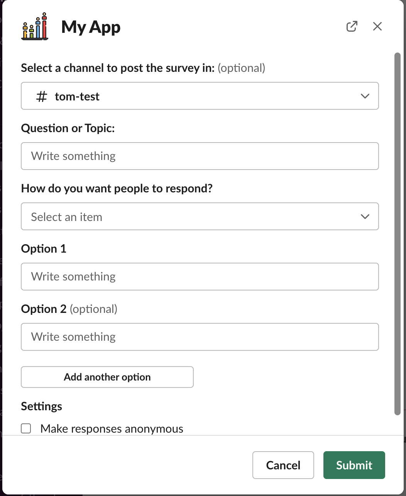

# VW-poll
Slack Poll app with GUI poll builder interface

# Requirements
- Slack Bolt SDK
- Python MongoDB Drivers
- MongoDB Cloud
- num2words library 
- Slack client secret, bot token, and mongo password

# Features
- GUI poll builder interface
- Anonymous or public options
- Polls stored in cloud MongoDB
- Abilitiy to vote for one or multiple options

# Improvement Ideas
- Ability to edit polls
- Ability to save polls
- User ability to add options to existing poll
- Limited time poll 

